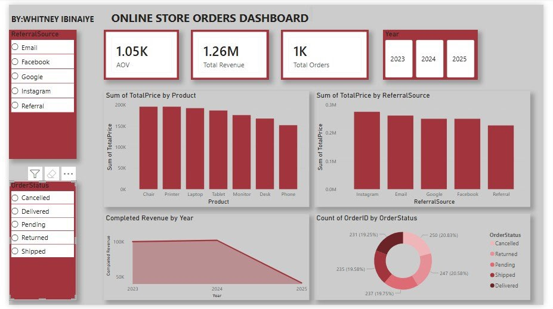

# Online-Store-Orders-Analysis-Dashboard-
This project involved analyzing an Online Store Orders dataset and building an interactive dashboard to uncover key business insights. The analysis focused on sales performance, product trends, marketing channel effectiveness, order fulfillment, and revenue patterns to support data driven decision making.

---

## Key Metrics

- **Total Orders:** 1K+
- **Total Revenue:** ₦1.26M
- **Average Order Value:** ₦1,050+

---

## Key Findings

### 1. Product Performance
- Chair, Printer, and Laptop emerged as the top revenue-generating products.
- Phone recorded the lowest revenue contribution at approximately **₦150K**, indicating an opportunity for improvement.

### 2. Marketing Channel Performance
- Instagram generated the highest revenue among all marketing channels.
- Email campaigns delivered the second-highest revenue.
- Referral traffic recorded the weakest performance and may require further evaluation.

### 3. Order Fulfillment Status
- Order statuses were distributed relatively evenly across different stages.
- Only **19.25%** of orders were successfully delivered, representing **231 orders**.
- Pending orders accounted for the largest share at **20.58%** (**247 orders**), highlighting potential inefficiencies in the fulfillment process.

### 4. Revenue Trend Analysis
- Revenue from completed orders remained relatively stable between **2023 and 2024**.
- A significant decline was observed in **2025**, requiring further investigation to determine whether the drop was caused by incomplete data, seasonality, or an actual decrease in sales.

---

## Recommendations

- Launch targeted promotional campaigns for Phone and Desk products to improve sales performance.
- Optimize order fulfillment processes and actively follow up on Pending and Shipped orders.
- Increase investment in Instagram marketing strategies while reassessing the effectiveness of the Referral channel.
- Conduct deeper analysis into the 2025 revenue decline to identify the root causes and implement corrective strategies.

---

## Conclusion

Every dashboard tells a story. This analysis demonstrates how data can be transformed into actionable insights that help businesses optimize operations, improve marketing strategies, and make smarter decisions that drive growth.

---

## Dashboard Preview

## Tools Used

- Microsoft Excel (Data Preparation)
- Pivot Tables (Data Analysis)
- Power BI (Interactive Dashboard Development)
- Data Visualization & Business Intelligence Techniques
